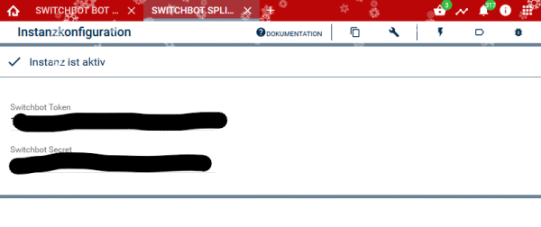

# Symcon Module SwitchBot
### API Version 1.1

### Inhaltsverzeichnis

1. [Funktionsumfang](#1-funktionsumfang)
2. [Voraussetzungen](#2-voraussetzungen)
3. [Software-Installation](#3-software-installation)
4. [Einrichten der Instanzen in IP-Symcon](#4-einrichten-der-instanzen-in-ip-symcon)
5. [Entwickler Keys](#5-entwickler-keys)
6. [Instanz Dokumentation](#6-instanz-dokumentation)
7. [Weitere Links](#7-weitere-links)

8. [Spenden](#8-spenden)

### 1. Funktionsumfang

### Das Modul unterstützt aktuell (01.07.2025) folgende Geräte.
* SwitchBot Bot (Cloud Unterstützung muss aktiviert sein)
* Curtain
* Lock / Smart Lock Pro / Smart Lock Ultra (Ultra inkl. Deadbolt-Funktion über Integer-Variable `lockControl`)
* Plug
* Strip Light
* Ceiling Light / Ceiling Light Pro
* Color Bulb
* Blind Tilt
* Air Purifier

### IR Fernbedienung 
* Light
* TV / Set Top Box
* DVD / Speaker

### 2. Voraussetzungen

* IP-Symcon ab Version 8.0
* SwitchBot Hub/Hub 2
* SwitchBot App (IOS oder Android) 
* Registrierter SwitchBot Account

### 3. Software-Installation

* Über den Module Store das 'SwitchBot Konfigurator-Modul' installieren.
* Alternativ über das Module Control hinzufügen

### 4. Einrichten der Instanzen in IP-Symcon

* SwitchBot Konfigurator installieren
* Es wird automatisch eine Splitter Instanz hinzugefügt.
* Im Splitter müssen  ein Token Key und ein Security Key eingegeben werden. Diese beiden Keys findet Ihr in der SwitchBot App. 

* Weitere Infos im nächsten Kapitel
* Weitere Informationen zum Hinzufügen von Instanzen in der [Dokumentation der Instanzen](https://www.symcon.de/service/dokumentation/konzepte/instanzen/#Instanz_hinzufügen)

### 5. Entwickler Keys

Die nötigen Token- und Security Keys müssen in der App generiert werden.
* Öffne die App
* Gehe zum Profil Menu
* Einstellungen
* Tippe 10 mal auf das App Versions Feld
* Damit werden die Entwickler Optionen aktiviert und ein neuer Menu Eintrag wird angezeigt.
* Gehe zum Menu Entwickler Optionen
* Generiere einen neuen Key

### 6. Instanz Dokumentation

Folgende Module beinhaltet das Switchbot Repository:

- __SwitchBot Splitter__ ([Dokumentation](SwitchBot%20Splitter))  
	Kurze Beschreibung des Moduls.

- __SwitchBot Konfigurator__ ([Dokumentation](SwitchBot%20Konfigurator))  
	Kurze Beschreibung des Moduls.

- __SwitchBot Device__ ([Dokumentation](SwitchBot%20Device))  
	Kurze Beschreibung des Moduls.

### 7. Weitere Links

* [SwitchBot (Official website)](https://www.switch-bot.com/)
* [API Dokumentation (GitHub)](https://github.com/OpenWonderLabs/SwitchBotAPI)

### 8. Spenden

Schenkungen zur Unterstützung sind hier möglich:

Danke an da8ter für die Unterstützung.